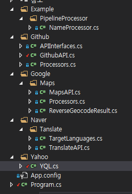

______      __ _       _ _       _      _____      _             __                   _   
|  _  \    / _(_)     (_) |     | |    |_   _|    | |           / _|                 | |  
| | | |___| |_ _ _ __  _| |_ ___| |_   _ | | _ __ | |_ ___ _ __| |_ __ _  ___ ___  __| |  
| | | / _ \  _| | '_ \| | __/ _ \ | | | || || '_ \| __/ _ \ '__|  _/ _` |/ __/ _ \/ _` |  
| |/ /  __/ | | | | | | | ||  __/ | |_| || || | | | ||  __/ |  | || (_| | (_|  __/ (_| |  
|___/ \___|_| |_|_| |_|_|\__\___|_|\__, \___/_| |_|\__\___|_|  |_| \__,_|\___\___|\__,_|  
                                    __/ |                                                 
                                   |___/                                                  
 

